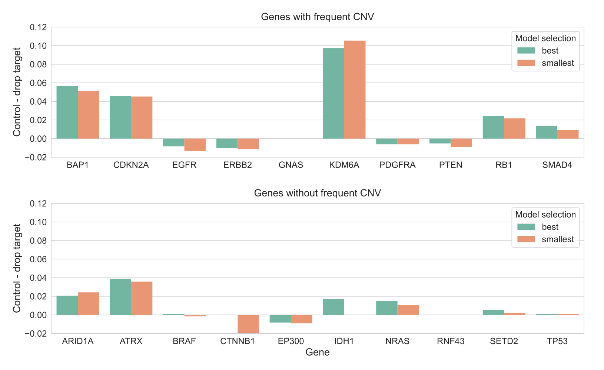
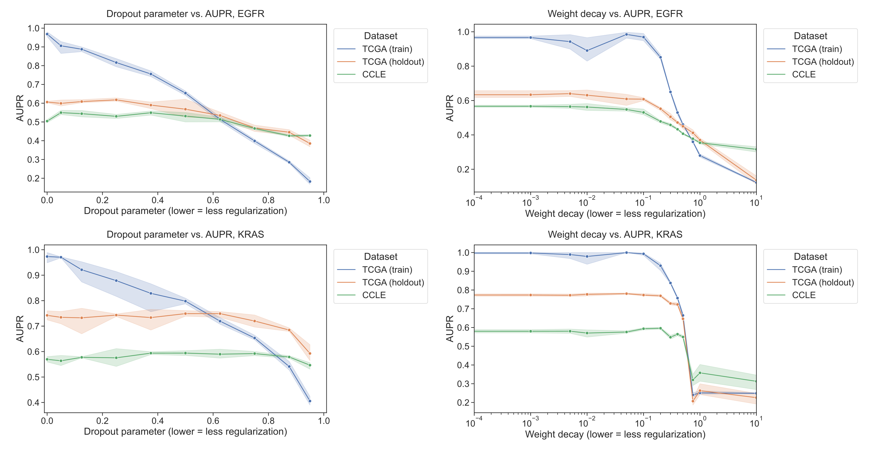

## Supplementary Material {.page_break_before}

{#fig:compare_sparsity tag="S1" width="100%"}

{#fig:compare_all_lr tag="S2" width="100%" .page_break_before}

{#fig:coef_weights_lr tag="S3" width="100%" .page_break_before}

{#fig:loss_lr tag="S4" width="100%" .page_break_before}
