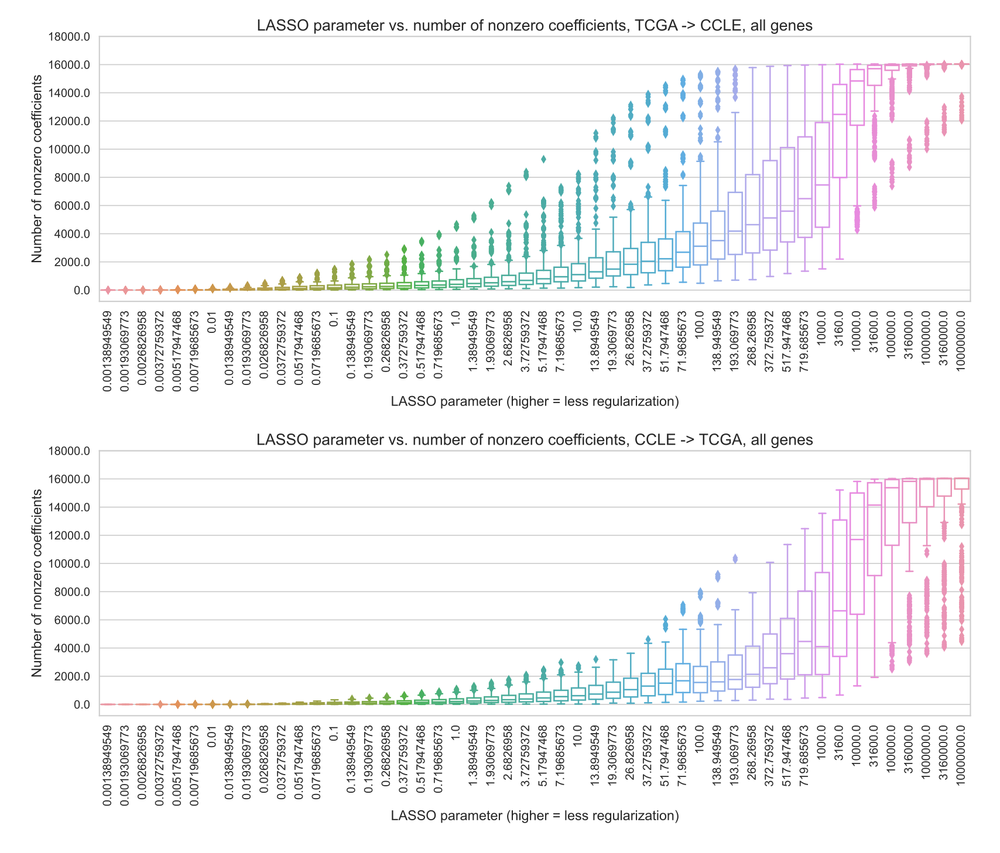

## Supplementary Material {.page_break_before}

### Supplementary Note S1

We were interested in exploring the extent to which excluding the target gene’s expression profile from the input features affects performance, if at all.
Additionally, since our labels include both point mutations and copy number changes, we sought to determine whether the answer to this question depends on the inclusion of copy number changes in the label set for a particular gene.
To test this across driver genes, we calculated the contribution of single nucleotide variant (SNV) and copy number variant (CNV) changes to each gene’s positively labeled sample set, and picked ten genes where CNV changes make up a relatively large proportion of positive labels, and ten genes where CNV changes make up a small proportion of positive labels.
Genes where positive labels commonly result from CNV changes are as follows:

| *Gene* | *SNV sample count* | *SNV + CNV count* | *SNV / (SNV + CNV) ratio*|
|:-------|:-------------------|:------------------|:-------------------------|
| BAP1 | 105 | 146 | 0.719 |
| CDKN2A | 288 | 1308 | 0.220 |
| EGFR | 192 | 444 | 0.432 |
| ERBB2 | 129 | 440 | 0.293 |
| GNAS | 99 | 266 | 0.372 |
| KDM6A | 163 | 295 | 0.553 |
| PDGFRA | 131 | 235 | 0.557 |
| PTEN | 584 | 985 | 0.593 |
| RB1 | 259 | 522 | 0.496 |
| SMAD4 | 131 | 289 | 0.453 |

And genes where samples are rarely positively labeled based on CNV changes:

| *Gene* | *SNV sample count* | *SNV + CNV count* | *SNV / (SNV + CNV) ratio*|
|:-------|:-------------------|:------------------|:-------------------------|
| ARID1A | 588 | 629 | 0.934 |
| ATRX | 455 | 508 | 0.896 |
| BRAF | 569 | 605 | 0.940 |
| CTNNB1 | 297 | 304 | 0.977 |
| EP300 | 256 | 265 | 0.966 |
| IDH1 | 414 | 415 | 0.997 |
| NRAS | 169 | 170 | 0.994 |
| RNF43 | 152 | 157 | 0.968 |
| SETD2 | 252 | 279 | 0.903 |
| TP53 | 3305 | 3372 | 0.980 |

We also considered baseline model performance in the choice of these gene sets.
If a gene has a very low or very high SNV / (SNV + CNV) ratio but the associated classifier generally performs poorly, we wouldn’t expect to observe a performance change, regardless of the input features.
For this experiment, the 20 genes we selected all had a reasonably high performance baseline, to maximize our ability to observe changes if they occur.

We visualized the mean difference in performance for the best-performing and "smallest good" models (LASSO parameters) with the “control” set of features, as compared to the best-performing and "smallest good" models with the “drop target” set of features (all of the gene expression features except the target gene), shown in Figure {@fig:supp_note}.
In general, we do observe that performance tends to be better for the “control” models, although there are some exceptions (EGFR, ERBB2, PDGFRA, PTEN, EP300) where the “drop target” model actually performs slightly better. We do observe that there are some genes (BAP1, CDKN2A, KDM6A, RB1, ARID1A, ATRX) where performance decreases considerably when the target gene is not present in the feature set.
For both the "best" and "smallest good" model selection approaches, this effect is slightly more consistent in the “frequent CNV” gene set than in the “rare CNV” gene set (mean control - drop target difference of 0.021/0.019 in the “frequent CNV” genes as compared to 0.009/0.004 in the “rare CNV” genes), but in both cases there is considerable variance between genes.

Based on these results, given the observation that the mean difference in model performance is fairly small in both "frequent CNV" and "rare CNV" cases, and for both model selection approaches, we conclude that combining point mutation and CNV data and including the target gene in the feature set are reasonable general rules for our pan-cancer and pan-gene study.
In general, our focus is less on individual prediction performance and more on model complexity, which is another degree removed from the individual prediction performance.
In addition, including the target gene would seem most likely to increase the benefit of smaller models, as the single-gene could be considered particularly information rich.
While these results don't seem to heavily influence our experiment examining generality, the exceptions we noted above emphasize the importance of considering the biological context in applications to specific driver genes or prediction problems.

{#fig:supp_note tag="S1" width="100%"}

{#fig:average_sparsity tag="S2" width="100%" .page_break_before}

{#fig:norms_vs_perf tag="S3" width="100%"}

![Distributions of number of features selected by the "best" and "smallest good" models, across seeds and folds, for TCGA to CCLE (top) and CCLE to TCGA (bottom) mutation prediction. Dotted lines show the median number of features for the best (blue) and smallest good (orange) numbers across genes: TCGA to CCLE - median of 144 features for the “best” approach and 17 features for the “smallest good” approach; CCLE to TCGA - median of 80 features for the “best” approach and 26 features for the “smallest good” approach.](images/supp_figure_4.png){#fig:best_smallest_features tag="S4" width="100%" .page_break_before}

{#fig:average_perf_by_gene tag="S5" width="100%" .page_break_before}

{#fig:thca_by_gene tag="S6" width="100%" .page_break_before}

{#fig:nn_dropout_wd tag="S7" width="100%" .page_break_before}

{#fig:nn_pca tag="S8" width="100%" .page_break_before}

![Performance across regularization parameter values for XGBoost mutation status classification, for generalization from TCGA to CCLE. Top row shows performance for EGFR across varying values of `num_estimators` and `max_depth` (Panel A), and for `max_depth=8` across a range of `num_estimators` (Panel B). Panel C summarizes the distribution of performance comparisons between "best" vs. "smallest good" `num_estimators` (33/71 genes best > smallest good, 17/71 smallest good > best, 20/71 best = smallest good).](images/supp_figure_9.png){#fig:xgboost_perf tag="S9" width="100%" .page_break_before}

{#fig:deep_nn_perf tag="S10" width="100%" .page_break_before}
